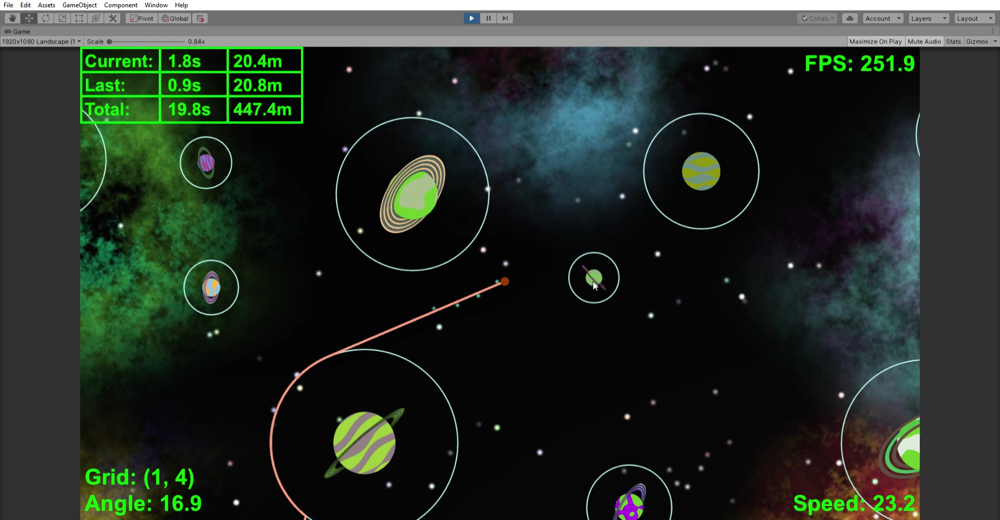
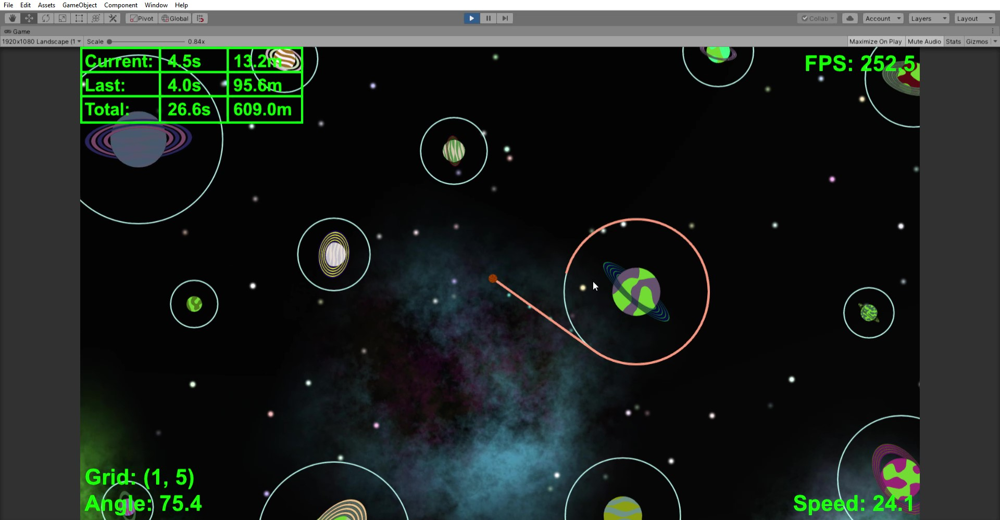
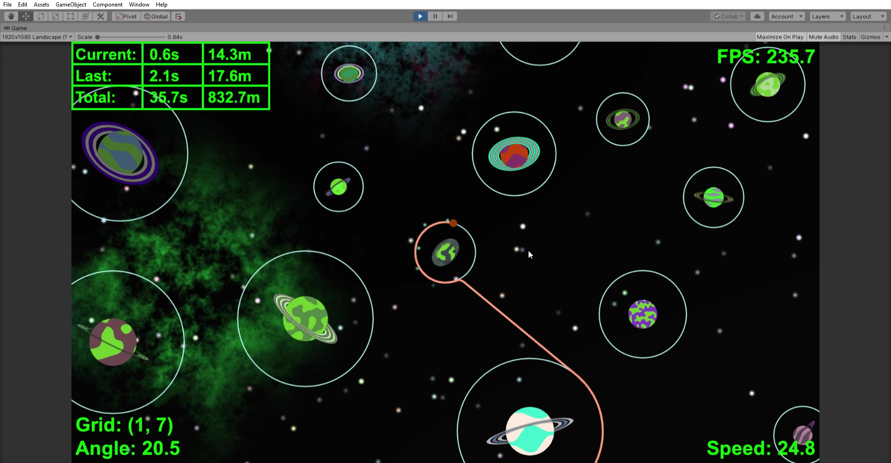
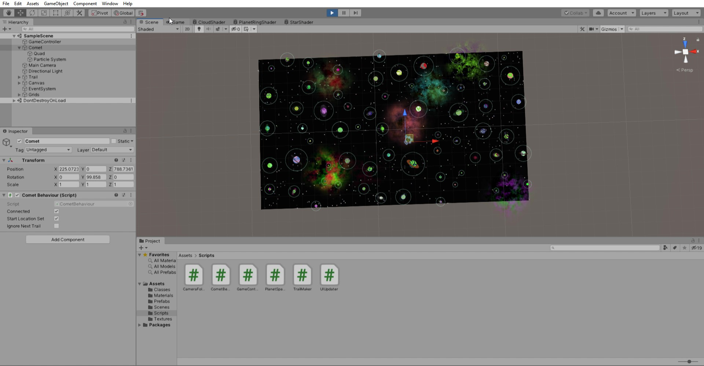

# Previews

Each of the images and videos in this section show a little of what the gameplay of Orbit looks like. Files with '\_gameplay' in the title show what the player would see (within the Unity environment), whereas those with '\_grid' in the title show the whole scene that is created beyond just the camera view.

## Video Previews

[Black Hole](https://drive.google.com/file/d/1qJpSj_C7dIGXqENBSZA99Fr6rl-6iGOA/view?usp=sharing)

[Gameplay](https://drive.google.com/file/d/18b5AinsYDQP-lQrr-khqDW6i_9I53_Jw/view?usp=sharing)

[Grid](https://drive.google.com/file/d/1axw2JhXCs-OwXCz5cw8OLpp1OTS3v_T-/view?usp=sharing)

## Gameplay Images

## Scene Images

