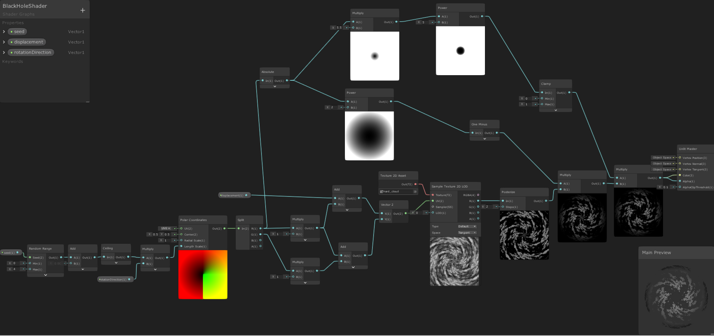
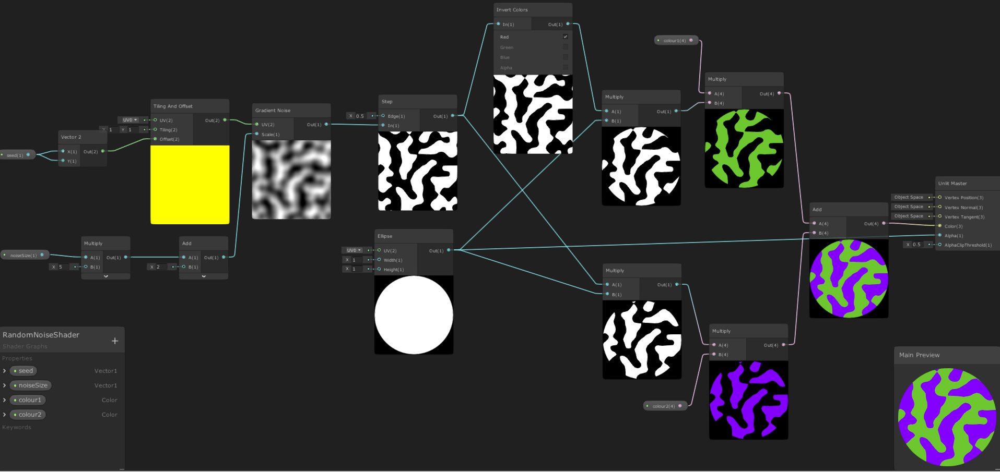

# Shaders

Unity has a built-in tool called 'Shader Graph', which allows you to define custom shaders for your material using only graphing by connecting nodes to various functions, a form of visual programming.

## black_hole_shader.png

This image shows the Unity 'Shader Graph' for creating a simple 'Black Hole' shader, which looks like a vortex which rotates and appears to either suck inwards or blow outwards. It allows 3 inputs: An integer '`seed`' which randomises and gives each black hole a distinct feel, '`rotationDirection`' which must be either 1 or -1 and describes whether the black hole rotates clockwise or anti-clockwise respectively, and a float '`displacement`' which when gradually increased makes the black hole suck inwards, and when gradually decreased makes the black hole blow outwards. A preview of this shader is given in the [previews folder](../previews) or can be viewed [here](https://drive.google.com/file/d/1qJpSj_C7dIGXqENBSZA99Fr6rl-6iGOA/view?usp=sharing).

## noise_planet_shader.png

This image shows the Unity 'ShaderGraph' for creating a 'Noise Planet' shader, which looks like a planet with 2 distinct colours, each distributed via smoothed random noise. It allows 4 inputs: An integer '`seed`' which randomises and gives each planet a distinct feel, a float '`noiseSize`' which sets how large the random noise is, and 2 colours '`colour1`' and '`colour2`' which define the colours of the planet. A preview of this shader can be seen in the gameplay images in the [previews folder](../previews).

I've no doubt my shaders are not fully optimised, but this project gave me the opportunity to learn how to use them and my next task would be to research more into how they could be better implemented.
